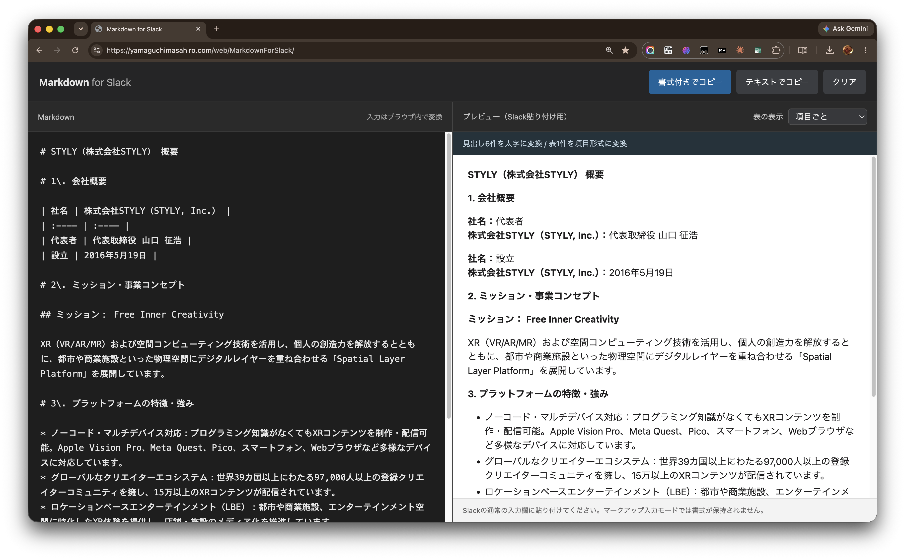

# Markdown for Slack

Convert Markdown into Slack-friendly formatting. Paste your Markdown, preview the result, and copy it into Slack. All conversion happens in your browser.

**Live site:** [https://yamaguchimasahiro.com/web/MarkdownForSlack/](https://yamaguchimasahiro.com/web/MarkdownForSlack/)

## Deployment

Updates to the `main` branch are automatically deployed to the server by GitHub Actions after the tests pass.

For local setup, conversion rules, testing, and deployment configuration, see the [development guide](docs/DEVELOPMENT.md).
